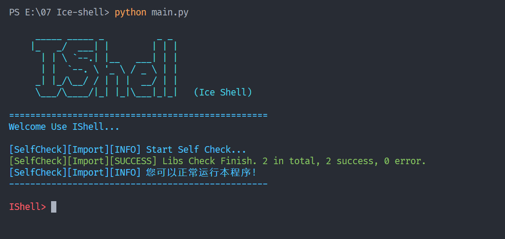

    

<b>Ice Shell</b> [aɪs ʃɛl]，一个Python编写的脚本运行框架，支持扩展模块

---

# 介绍
Ice Shell（简称IShell），是一个Python编写的脚本运行框架，支持扩展模块。

## IShell设计初衷
往往我们在用Python完成某个小功能时，我们都会直接新建单个Python文件，写完之后就放在一个不知名的小角落，然后使用的时候直接双击运行。

但是这个操作往往会出现很多问题。如果你的程序很复杂，封装了很多的函数，用传统的方式就会造成一些困难，比如依赖问题或是变量问题。而且，当你想要将文件发布出去时，不仅孤零零的一小撮文件不太好看，而且如果他人要想使用这个Python，往往会因为依赖等的问题而无法运行。

同时，IShell也为Shell类程序提供了良好的开发平台。您可以给予IShell开发您自己的程序（如远控，木马）等。

## IShell功能

- [ ] 自定义模块功能与命令
- [ ] 捕获报错信息
- [ ] 依赖检测与安装
- [ ] 一键配置程序信息
- [ ] 一键配置程序依赖
- [ ] 一键发布程序
- [ ] 模块参数自定义

更多功能敬请期待~

有什么问题和建议可以直接提Issue或者PR

有意开发可以加我微信：lanbinleo 或者 QQ：271360178

# 使用方法

1. 下载最新版Release [点我前往Release](https://github.com/lanbinshijie/IceShell/releases)

2. 下载源代码并解压到本地

3. 运行`python main.py`

4. 添加拓展模块

**注意！不推荐直接在CMD里运行，推荐找专业终端体验全部功能（如VSCode的终端）**

运行效果如图所示

# 参与开发

您可以联系我的
- 微信：lanbinleo
- QQ：271360178
- 邮箱：[me@lanbin.top](mailto:me@lanbin.top)

或者直接提交issue

## 近期任务

- [ ] 一键检测依赖并询问是否安装
- [ ] 将模块部分从主程序中剥离出来
- [ ] 重构难看的Logo

## 代码提交标准（给自己看的）
- feat：新功能
- fix：修补bug
- docs：修改文档
- style： 格式化代码结构（不影响代码运行的变动）
- refactor：重构（即不是新增功能，也不是修改bug的代码变动，比如重命名变量
- chore：构建过程或辅助工具的变动（不会影响代码运行）

# 后记

- Logo链接
    1. https://s1.ax1x.com/2023/01/13/pSK4gln.png
    2. https://s1.ax1x.com/2023/01/13/pSK42yq.png